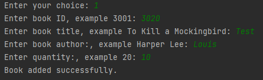

# Bookstore Inventory Management

This project is a Python program that allows users to manage a bookstore inventory. It provides functionalities to add new books, update existing books, delete books, search for books, view all books, and reset the database.
Table of Contents

# Table of Contents

- [Installation](#installation)
- [Usage](#usage)
- [Credits](#credits)

# Installation

To run this project locally, please follow these steps:

Clone the repository to your local machine.

`git clone <repository-url>`

Navigate to the project directory.

`cd bookstore-inventory-management`

Install the required dependencies.

`pip install sqlite3`
`pip install tabulate`

Run the Python script.

`python database_test.py`

Note: Make sure you have Python and pip installed on your system.
# Usage

Once the program is running, you can use the following options:

- **Enter new book**: Allows you to add a new book to the bookstore inventory by providing details such as book ID, title, author, and quantity.

  
  *Figure 1: Adding a new book to the inventory.*

- **Update book**: Enables you to update the details of an existing book. You can choose the book by its ID and modify the title and author.

  
  *Figure 2: Updating book details.*

- **Delete book**: Lets you remove a book from the inventory by selecting its ID.

  
  *Figure 3: Deleting a book from the inventory.*

- **Search books**: Allows you to search for a book by its ID and displays its details if found.

  
  *Figure 4: Searching for a book by ID.*

- **View Books**: Displays a table of all the books in the bookstore inventory.

  
  *Figure 5: Viewing all the books in the inventory.*

- **Reset database**: Resets the database, removing all the existing books. Use this option with caution as it cannot be undone.

  
  *Figure 6: Resetting the database.*

- **Exit**: Exits the program.

# Credits
  
 This project was created by Louis Ferreira. If you have any questions or suggestions, please feel free to reach out.
 Here is my email: gerhardus321@protonmail.com
